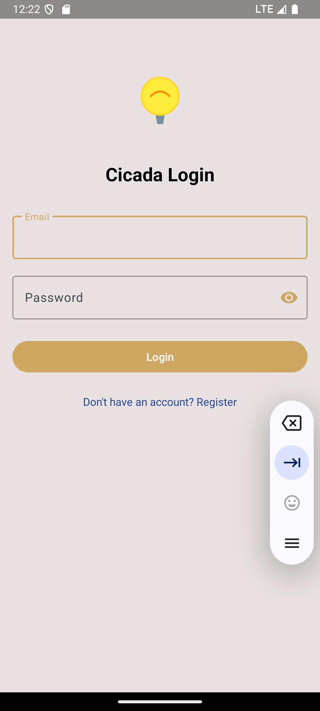
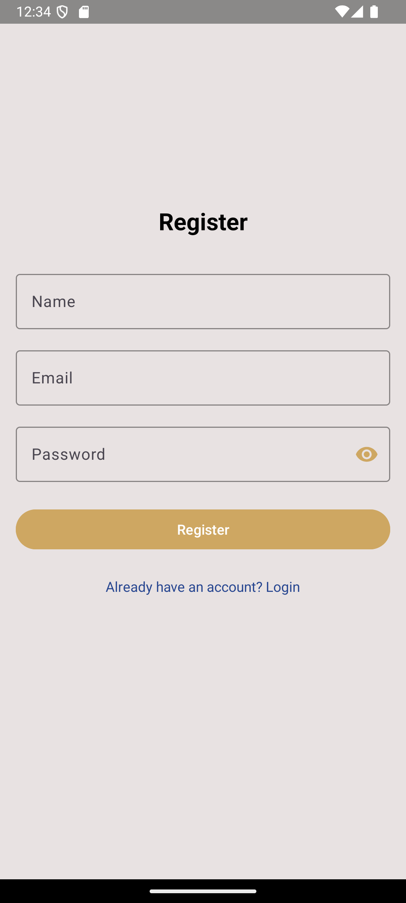
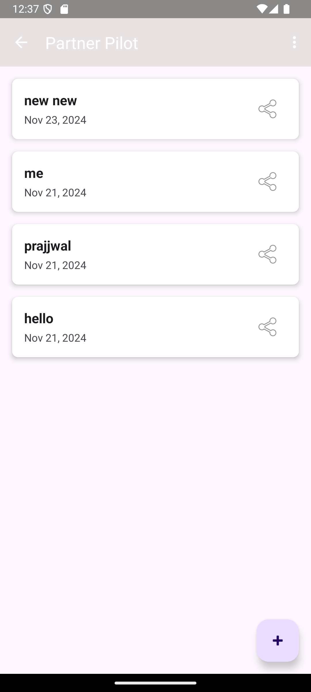
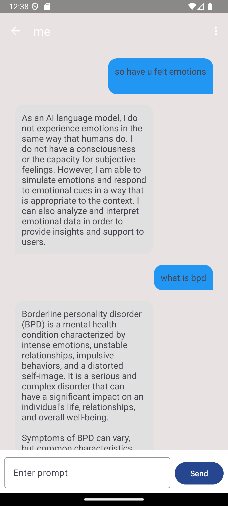
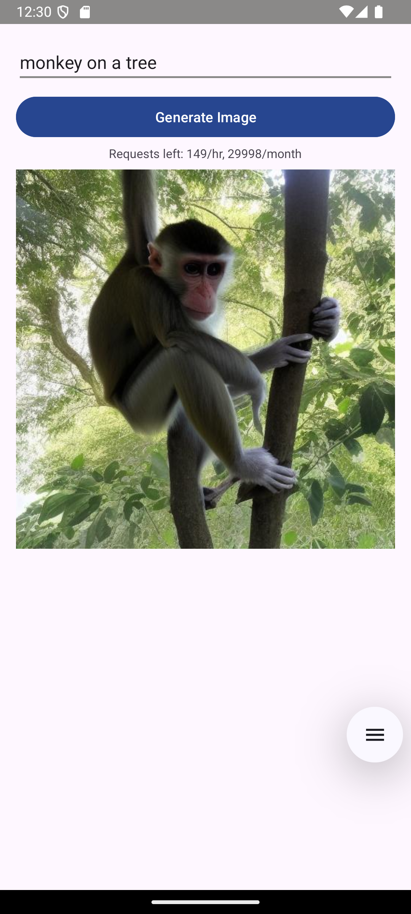
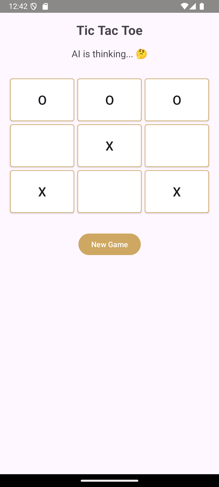
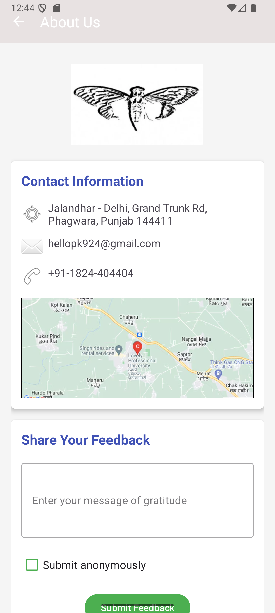

# PartnerPilot - Gemini AI Android App

An Android application that integrates Google's Gemini AI API to provide various AI-powered features including chat, daily tips, gallery, and entertainment features.

## Features

- **AI Chat**: Interactive chat interface powered by Google Gemini AI
- **Daily Tips**: Get daily AI-generated tips and suggestions
- **Gallery**: Browse and manage images with AI assistance
- **Sessions**: Track and manage conversation sessions
- **Tic Tac Toe**: AI-powered game experience
- **Artist Mode**: Creative AI features for artistic content("artist ")
- **User Authentication**: Register and login system

## Tech Stack

- **Language**: Kotlin
- **UI**: Android Views with ViewBinding
- **AI Integration**: Google Generative AI SDK (Gemini)
- **Networking**: Retrofit2 + OkHttp3
- **Database**: Room Database
- **Image Loading**: Glide
- **Architecture**: MVVM pattern

## Requirements

- Android SDK 24 or higher
- Target SDK 33
- Kotlin 1.9.10
- Google Gemini AI API key

## Setup

1. Clone this repository
2. Open in Android Studio
3. Add your Gemini AI API key to `local.properties`:
   ```
   GEMINI_API_KEY=your_api_key_here
   ```
4. Sync the project and run

## Screenshots

## Screenshots










## Dependencies

- Google Generative AI: `0.2.2`
- Retrofit: `2.9.0`
- Room Database: `2.6.1`
- Material Design: `1.11.0`
- Glide: `4.12.0`

## Project Structure

```
app/
├── src/main/java/com/example/gemniapi/
│   ├── SplashActivity.kt
│   ├── LoginActivity.kt
│   ├── RegisterActivity.kt
│   ├── ChatActivity.kt
│   ├── SessionsActivity.kt
│   ├── DailyTipActivity.kt
│   ├── Gallery.kt
│   ├── TicTacToeActivity.kt
│   ├── ArtistActivity.kt
│   └── AboutUsActivity.kt
└── src/main/res/
    ├── layout/
    ├── values/
    └── mipmap/
```

## Security

⚠️ **Important**: The `local.properties` file contains sensitive API keys and should never be committed to version control. Make sure it's included in your `.gitignore` file.

## License

[Add your license information here]

## Contributing

[Add contribution guidelines here]
